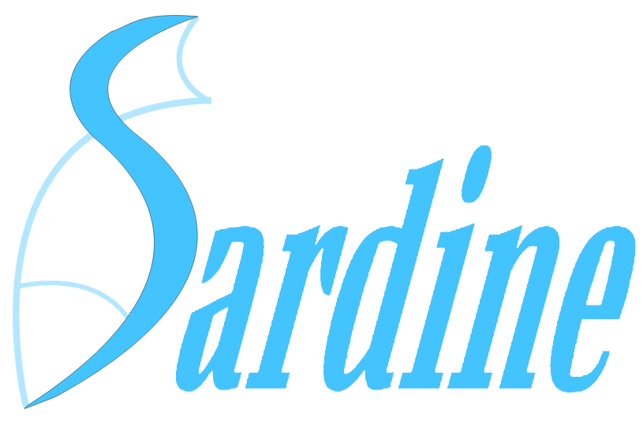

<div align="center">
  
  <br>
</div>

# Sardine: A Custom Language Made with Python

Sardine is a custom programming language built with Python. It combines a powerful **Lexer**,
**Parser**, and **Interpreter** to process and execute code written in our bespoke language. In
addition, Sardine offers an **Interactive Shell** for real-time coding, and will soon be offering a **REST API** for remote
execution and parsing, and a modern **Web Frontend** to enhance your development experience.

[](https://github.com/Souvik606/SARDS/actions/workflows/tests.yml)

---

## Features

- **Interactive Shell**: A REPL to write, inspect, and execute Sardine code interactively.
- **File Input Programs**: Currently can run code in `sards/samples/main.sad`. Multiple file executability planned.
- **Full Language Parser/Interpreter**: Includes a tokenizer, parser, AST builder, and interpreter for language elements such as **if/else**, **while**, **for**, **switch-case**, **functions**, **classes**, and **exceptions**.
- **Python-native Architecture**: Built in pure Python for easy learning, maintenance, and extensibility.
- **Stable Testable Core**: Modular separation of lexer, parser, AST, and interpreter makes unit testing and feature expansion straightforward.
- **Pluggable Extensions**: Designed for future language features, custom data types, and more complex control flow via clear node and token abstractions.
- **Developer-Friendly**: Includes meaningful error messaging and a concise shell workflow for experimentation.

## Prerequisites

- [Python](https://www.python.org/) (v3.10 or higher)
- [Git](https://git-scm.com/)

---

## Setup

1. **Clone the repository:**

   ```bash
   git clone https://github.com/Souvik606/Sardine.git
   cd Sardine
   ```

2. **Run the Interactive Shell:**

   ```bash
   python -m sards.shell
   ```

3. **Run the Shell in REPL Mode:**

   Enter 0 when prompted by the Shell and explore the Sardine language on the fly.

4. **Run a Sardine program:**

   Edit `sards/samples/main.sad` to your intended Sardine language program, run the Shell and enter 1 to run File Input mode when prompted.

---

## Language Details

- Dynamically typed variables
- Default data types of Integer, Float, String, List, Dictionary
- Arithmetic, Bitwise and Logical operators
- Nestable, heterogeneous Lists and Dictionaries with List and Dictionary functions
- User-defined functions with recursion
- Object-oriented Programming
- Error Handling (`risk-trap-clean`)
- For Loops (`Cycle`)
- While Loops (`whenever`)
- Switch-Case (`menu`)
- If-Else-Elif (`when-orwhen-otherwise`)

Please view `docs/grammar_rules.md` for details on all grammar rules. User manual for more friendly explanation of syntax is under construction.

---

## Future Plans

- **REST API (Planned)**: Exposes endpoints to execute code, inspect results, and retrieve AST trees remotely for integration with IDEs or services.
- **Web Frontend (Planned)**: A sleek, interactive UI for writing, visualizing, and debugging Sardine code.

---

## License

This project is licensed under the MIT License. See the [LICENSE](LICENSE) file for details.

---

## Contributing

Contributions are welcome! Please read
our [Contributing Guidelines](CONTRIBUTING.md) to get started.
